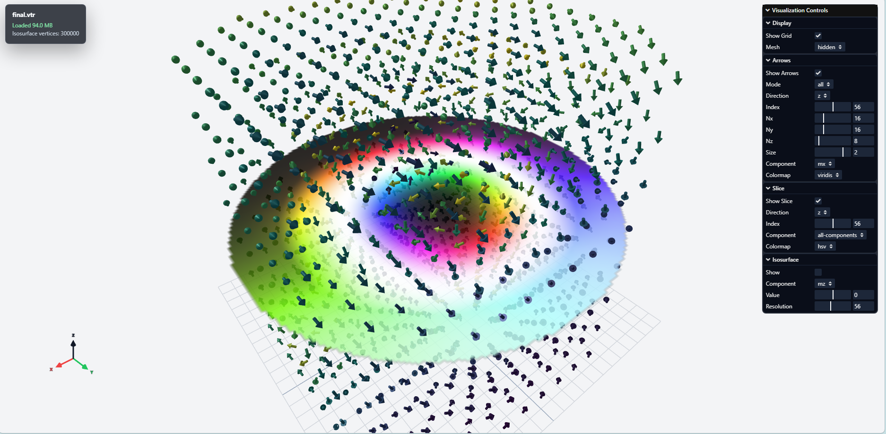

# TargetSkyrmion VTR Visualization

Live demo:

https://respsnty.github.io/visualization/



## 展示内容

- 自动读取 `final.vtr` 的 `RectilinearGrid` 数据。
- 默认显示 `z` 方向中间层的 slice。
- 默认叠加三维磁化箭头。
- `(0, 0, 0)` 的背景区域不会显示在 slice、箭头和等值面中。
- 左下角提供透明背景的 XYZ 坐标轴参考。

## 控制说明

### Display

- `Show Grid`: 显示或隐藏参考网格。
- `Mesh`: 切换外框显示方式，包括 `outline`、`box` 和 `hidden`。

### Arrows

- `Mode`
  - `all`: 在整个三维区域中采样显示箭头。
  - `layer`: 只显示某一个切片层上的箭头。
- `Direction`: 在 `layer` 模式下选择层方向，支持 `x`、`y`、`z`。
- `Index`: 在 `layer` 模式下选择层编号，会根据数据尺寸自动调整范围。
- `Nx / Ny / Nz`: 控制箭头采样密度。
- `Size`: 控制箭头大小。
- `Component`: 用 `mx`、`my` 或 `mz` 分量给箭头着色。
- `Colormap`: 选择箭头颜色映射。

### Slice

- `Direction`: 选择切片方向。
- `Index`: 选择切片层编号。
- `Component`
  - `all-components`: 面内方向使用 HSV 彩色映射，`mz` 用黑白明暗叠加。
  - `mx / my / mz`: 单独显示对应分量。
- `Colormap`: 选择 slice 的颜色映射。

`all-components` 的面内颜色相位使用与 ParaView 一致的公式：

```python
-(arctan2(m_y, m_x) + 2*pi) % (2*pi)
```

### Isosurface

- `Show`: 开启或关闭等值面。
- `Component`: 选择 `mx`、`my` 或 `mz` 分量生成等值面。
- `Value`: 设置等值面数值。
- `Resolution`: 设置 Marching Cubes 分辨率。数值越高，等值面越细致，但计算更慢。

## 加载说明

`final.vtr` 大小约为 94 MB。首次打开网页时，浏览器需要下载这个数据文件，因此加载时间取决于网络速度。加载完成后，左上角状态栏会显示网格尺寸：

```text
Grid 136 x 136 x 111; 2053056 magnetization vectors
```

## 本地预览

如果要在本地查看，可以在项目目录运行：

```powershell
python -m http.server 8000
```

然后打开：

```text
http://127.0.0.1:8000/
```

不要直接双击打开 `index.html`，因为浏览器通常会阻止网页读取本地的 `final.vtr` 文件。
